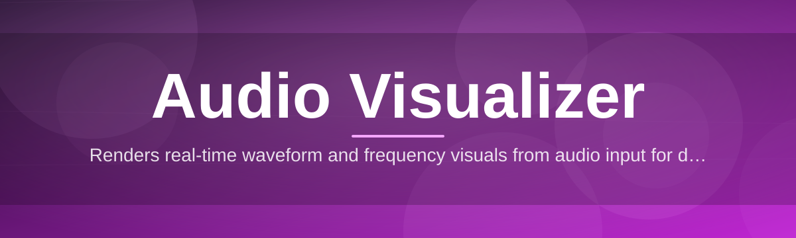
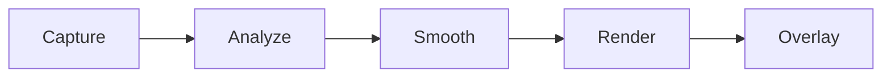

# av-overlay 🎧✨

  

*Turn any sound into a living, breathing overlay — right on top of your screen.*

  

---

## 📖 Overview

**TL;DR:** av-overlay paints your system audio into real-time motion graphics that float above every window — no capture card, no green screen, no fuss.

Audio has always been the invisible half of the show. We see the waveform on a mixing console, we see the spectrum in a DAW, but the moment we tab away, that visual feedback vanishes. **av-overlay** was built to fix that gap by turning your desktop into a canvas. It listens to whatever is playing — music, a podcast, a game, a livestream — and renders a translucent, always-on-top visualizer that reacts in milliseconds. Think of it as a heads-up display for sound: bars that pulse with the bassline, waveforms that ripple like water, particles that scatter on a snare hit.

This project sits at the intersection of **audio visualization**, **desktop overlays**, and **streaming production tools**. It's for musicians recording practice sessions, streamers who want reactive on-screen flair without touching OBS shader packs, video editors previewing sync points, and just about anyone who thinks silence looks better with a little motion. Unlike heavyweight DAW plugins or browser-based spectrum analyzers, av-overlay runs natively on Windows as a **standalone executable** — no runtime installs, no background services eating your CPU, no accounts to create.

We designed it around one guiding idea: visual feedback for audio should feel as immediate as the sound itself. Every render pass, every color transition, every particle decay curve was tuned by ear first, then by eye — because a visualizer that looks great but lags behind the beat defeats its own purpose.

---

## 📋 At a Glance

**TL;DR:** here's everything you need before you click download.

| Requirement | Details |
|---|---|
| **OS** | Windows 10 (64-bit) or Windows 11 |
| **Type** | Standalone `.exe` — zero dependencies |
| **RAM** | 4 GB minimum, 8 GB recommended |
| **GPU** | Any DirectX 11-capable GPU (integrated works fine) |
| **Audio** | Any active playback device or loopback source |
| **Disk space** | ~150 MB |
| **Internet** | Not required after download |

> [!NOTE]
> av-overlay does **not** require .NET runtimes, Visual C++ redistributables, or Python to be pre-installed. It ships everything it needs inside the executable.

---

## 🔥 What It Actually Does

**TL;DR:** eight ways av-overlay turns raw sound into on-screen motion — pick and mix.

- **Real-time spectrum rendering** — a live FFT-driven audio visualizer that redraws frequency bands dozens of times per second, so bass drops actually *look* like bass drops.

- **Always-on-top transparent overlay** — floats above games, browsers, and creative apps without stealing window focus or clicking through to what's underneath.

- **Multiple visual modes** — switch between bar spectrum, oscilloscope waveform, radial pulse, and particle-burst rendering styles depending on the mood of the track.

- **Loopback and microphone capture** — visualize whatever your system is playing back *or* whatever's coming through your mic, toggled with a single hotkey.

- **Color theme engine** — gradient palettes that shift with amplitude, so louder passages don't just get taller bars, they get brighter, warmer color.

- **Low-latency audio pipeline** — engineered to keep the visual-to-audio delay imperceptible, because a sluggish visualizer is worse than no visualizer at all.

- **Custom overlay positioning** — resize, anchor, or dock the visualizer to any screen edge or corner, ideal for stream layouts and second-monitor setups.

- **Session presets** — save a combination of mode, palette, and size as a preset you can recall instantly before a recording or stream starts.

> [!TIP]
> Pair the **particle-burst** mode with a dark theme for content with sharp transients — drums, glitch, breakcore — it reads incredibly well on camera.

---

## 🚀 Getting Started

**TL;DR:** visit the page, download, run, pick a mode. That's it.

1. **Visit the landing page** using the download button above or below.

2. **Download the latest build** — it's a single portable executable, no installer wizard required.

3. **Run av-overlay.exe** — Windows may show a SmartScreen prompt for new executables; click *More info → Run anyway*.

4. **Choose your audio source and visual mode** from the tray menu, then drag the overlay wherever you like on screen.

> [!IMPORTANT]
> Because av-overlay is a fresh, independently-signed build, Windows Defender SmartScreen may flag it on first run simply for being unrecognized — this is standard for new indie tools and not a sign of a problem.

🖱️ Quick setup for streaming software (click to expand)

- Add av-overlay as a **Window Capture** source (not Display Capture) inside your streaming or recording software.

- Enable **transparency** in the capture source properties if your software supports alpha channels.

- Position the overlay window on a secondary monitor for a cleaner scene layout, then crop the capture region.

- Lock the overlay's position using the pin icon in the tray menu so it doesn't drift mid-stream.

---

## ⚙️ How It Works

**TL;DR:** audio in, math in the middle, motion out — five stages, no black magic.

The engine listens to a system audio stream, runs it through a windowed FFT to extract frequency-domain data, smooths that data across frames to avoid flicker, and hands it to a GPU-accelerated renderer that draws the current visual mode. The result is composited onto a transparent, click-through, always-on-top surface.

1. **Capture** — taps into loopback or microphone audio at the driver level.
2. **Analyze** — performs FFT analysis to break the signal into frequency bins.
3. **Smooth** — applies temporal interpolation so bars don't jitter frame to frame.
4. **Render** — draws the active visual mode using hardware-accelerated graphics.
5. **Overlay** — composites the frame onto a transparent always-on-top window.

---

## 🧩 Troubleshooting

**TL;DR:** most hiccups are audio-source or driver related — here's the quick fix list.

**Q: The overlay is on screen but nothing is moving.**
A: Check that the correct audio device is selected in the tray menu — Windows sometimes defaults to a device that isn't actually playing sound.

**Q: My overlay shows up as a solid black box instead of being transparent.**
A: This usually means your capture software is using Display Capture instead of Window Capture, or hardware acceleration is disabled in that app.

**Q: The visualizer feels slightly delayed compared to the music.**
A: Lower the buffer size in Settings → Audio → Latency Mode; smaller buffers reduce delay at a small CPU cost.

**Q: SmartScreen won't let me open the app.**
A: Click "More info" then "Run anyway" — this is expected for new, actively-developed executables without a long-standing certificate history.

**Q: Can I visualize audio from just one app instead of the whole system?**
A: Per-application loopback capture is on the roadmap; for now, av-overlay visualizes the full system mix.

**Q: The frame rate drops when I resize the overlay very large.**
A: Extremely large overlay dimensions increase per-frame render cost — try capping size at 1080p equivalent for smooth performance on integrated GPUs.

---

## 🎨 UI / UX Details

**TL;DR:** keyboard-first controls, three built-in themes, everything saved automatically.

| Shortcut | Action |
|---|---|
| `Ctrl + Shift + V` | Toggle overlay visibility |
| `Ctrl + Shift + M` | Cycle visual mode |
| `Ctrl + Shift + T` | Cycle color theme |
| `Ctrl + Shift + L` | Lock/unlock overlay position |
| `Esc` | Minimize to system tray |

- **Themes**: *Midnight Cyan*, *Sunset Amber*, and *Mono Grid* — each tuned for different lighting and stream backgrounds.
- **Settings persistence**: every adjustment — size, mode, theme, opacity — is saved locally and restored on next launch.
- **Opacity slider**: blend the overlay subtly into a scene rather than having it dominate the frame.

> [!TIP]
> `Mono Grid` theme reads especially well on OBS scenes with busy backgrounds, since it relies on contrast rather than saturated color.

---

## 🤝 Contributing & Community

**TL;DR:** issues, ideas, and pull requests are genuinely welcome — this is a community-shaped tool.

  

> [!WARNING]
> Please open an issue describing your proposed change *before* submitting a large pull request — it saves everyone time and keeps feature direction consistent.

- Found a bug? Open an issue with your Windows version, GPU, and steps to reproduce.
- Have a visual mode idea? Sketch it, describe the motion, and open a discussion thread.
- Want to help with testing? New builds regularly need eyes across different display setups and refresh rates.

---

## 📜 License

**TL;DR:** MIT, 2026 — do almost anything, just keep the notice.

This project is licensed under the [MIT License](LICENSE). Fork it, remix it, build on top of it — just retain the original license notice in redistributed copies.

---

## ⚠️ Disclaimer

**TL;DR:** provided as-is, use your own judgment, no guarantees.

av-overlay is provided "as is," without warranty of any kind, express or implied. The maintainers are not responsible for any performance impact, display issues, or data loss resulting from use of this software. Always download from the official landing page linked in this README to ensure you're running an authentic build.

---

